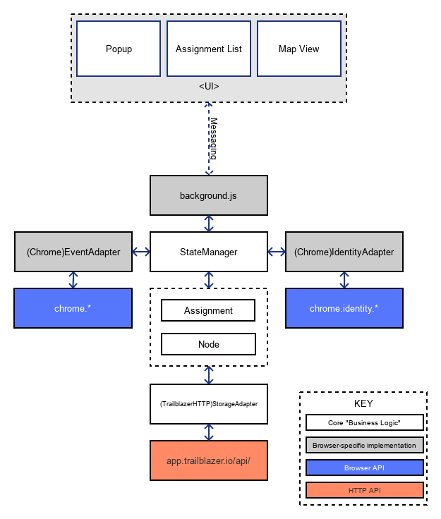

# Trailblazer "Wash"

Trailblazer is a Chrome extension built to track a user's browsing activity and
build up a map, helping them make sense of the places they visit.

## Install

```git clone git://github.com/twingl/trailblazer-wash.git

cd trailblazer-wash

npm install```

##Develop

From the root directory ```npm run develop``` will watch for changes to the jsx files in ```/ui/pages/js/src``` and compile them to js in ```ui/pages/js/build```

## Structure

The extension is structured in the following way:



The diagram above shows two distinct parts of the extension:

  - Browser-specific adapter and glue code
  - Agnostic core logic (a.k.a. "Business Logic")

The browser specific code handles things like the UI, messaging between UI and
StateManager, and interfacing with browser APIs. The majority of non-UI code
under these blocks is glue-code used to translate browser-specific actions and
events into ones that the core can use without sacrificing portability.

The core itself houses the state of the application, and manages any
transactions to do with identity/auth and resource persistence.

### StateManager

This is the main entry point into having a functioning instance. It is
documented in more detail over in its [JSDoc page](./StateManager.html),
however the brief summary is that it is instantiated inside background.js and
the appropriate adapters are specified (e.g. ChromeEventAdapter,
ChromeIdentityAdapter) so that it can properly integrate with the browser.

### background.js

This is the main interface between the StateManager and the rest of the
interface. UI components pass messages to this long-running background script
to effect state changes (e.g. stop a Tab's recording session) and retrieve data
(e.g. get the current Node).

## Documentation

The source is documented with JSdoc, whose output is in /doc.

To generate new documentation, ensure you have jsdoc installed (the dependency
is specified in package.json)

    $ npm install

Then annotate your source and run the shell script (you'll need `bash`
available)

    $ ./doc.sh

This will clear existing documentation, and assemble a new build using the
jsdoc binary inside `node_modules/`.
